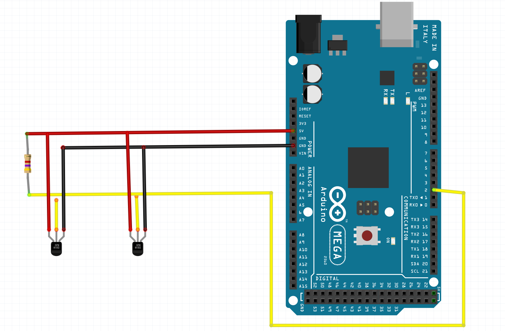
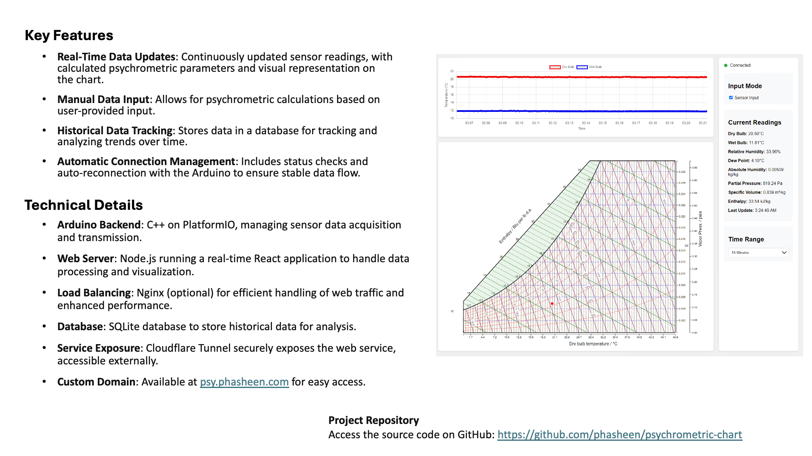

# psychrometric-chart

## Description
This repo contains the documentation of [Psychrometric](https://en.wikipedia.org/wiki/Psychrometrics#:~:text=Mixtures%20of%20air%20and%20water%20vapor%20are%20the) Instrument which was created for the assigment of the course of Design of Agricultural Processing Machine hosted by Prof. 김기석 (Ghiseok Kim), Dept of Biosystems Engineering, CALS-SNU. 
The team members are:
- Xianghui Xin (신상우)
- 문동주
- 선동현

## Contents
- [Description](#description)
- [How to Use](#how-to-use)
- [Hardware Design](#hardware-design)
- [Software Design](#software-design)
- [Hardware Parts List](#hardware-parts-list)
- [Acknowledgement](#acknowledgement)
- [References](#references)

## How to Use
```
node server.js
```

```
brew services restart nginx
```

```
cloudflared tunnel run psychrometric-chart
```


### cloudflared config


~/.cloudflared/config.yml


### nginx config

/opt/homebrew/etc/nginx/nginx.conf

## Hardware Design
### Hardware Parts List
The following lists contain the link to buy (Coupang).
- [Arduino UNO kit - 1pc](https://www.coupang.com/vp/products/1985589949?itemId=3378785223&vendorItemId=71365465000&pickType=COU_PICK&q=Arduino+Kit&itemsCount=36&searchId=90f9b28425a34a52b5a89838543bc32a&rank=1&isAddedCart=)
- [DS18B20 Temperature Sensor - 2pcs](https://www.coupang.com/vp/products/70528314?itemId=235762133&vendorItemId=3564994262&q=DS18B20&itemsCount=36&searchId=ba6e5027c9a540c0a0606278bbf54974&rank=1&isAddedCart=)
- [Stand - 1pc](https://www.coupang.com/vp/products/66520363?itemId=21612072140&vendorItemId=88675889507&q=L298N&itemsCount=36&searchId=74ce195edd1d424286f8e31b936a6507&rank=0&isAddedCart=)
- [Fan - 1pc](https://www.coupang.com/vp/products/7996571299?itemId=22246880434&vendorItemId=89293426760&q=%EC%86%8C%ED%98%95+%ED%8C%AC&itemsCount=36&searchId=9c47b3f5059e455d9f5a838aec6ff48c&rank=6&isAddedCart=)
- [Anemometer - 1pc](https://www.coupang.com/vp/products/8192902033?itemId=23453033261&vendorItemId=73031508876&q=%ED%92%8D%EC%86%8D%EA%B3%84&itemsCount=36&searchId=7a7741756f6d49f4b6a9af78966f4b84&rank=0&isAddedCart=)



## Software Design



### Sample data
```
Server is running on port 3000
Serial port opened successfully
Raw data received: Dry Bulb Sensor Address: 28616434CDA6C550
Raw data received: Wet Bulb Sensor Address: 286164348C3691B3
Raw data received: --- New Reading ---
Raw data received: Requesting temperatures...
Raw data received: Raw Readings - Dry: 22.19°C, Wet: 13.94°C
Raw data received: Calculated Values:
Raw data received: Relative Humidity: 39.41%
Raw data received: Absolute Humidity: 0.00657 kg/kg
Raw data received: Dew Point: 7.75°C
Raw data received: Partial Pressure: 1054.49 Pa
Raw data received: Specific Volume: 0.846 m³/kg
Raw data received: Enthalpy: 39.01 kJ/kg
Raw data received: 22.19,13.94,0.3941,7.75,0.00657,1054.49,0.846,39.01

Processed data: {
  type: 'data',
  dryBulb: 22.19,
  wetBulb: 13.94,
  relativeHumidity: 39.41,
  dewPoint: 7.75,
  absoluteHumidity: 0.00657,
  partialPressure: 1054.49,
  specificVolume: 0.846,
  enthalpy: 39.01,
  timestamp: '2024-11-05T01:17:38.914Z'
}
```
## Acknowledgement
This project was funded by Prof. Ghiseok Kim from Lab of Physical Properties and Process Engineering of Agricultural Products ([SNUPHEL](https://snuphel.snu.ac.kr/)).

## References
- https://git.snuphel.com/yudha/psychrometricinstrument
- https://github.com/mitchpaulus/psychrometric-chart
